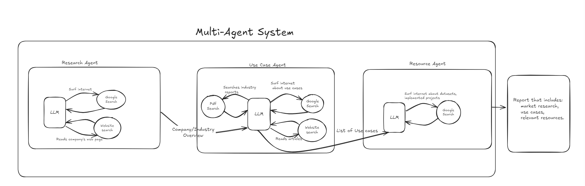
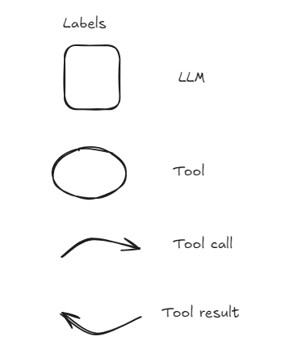
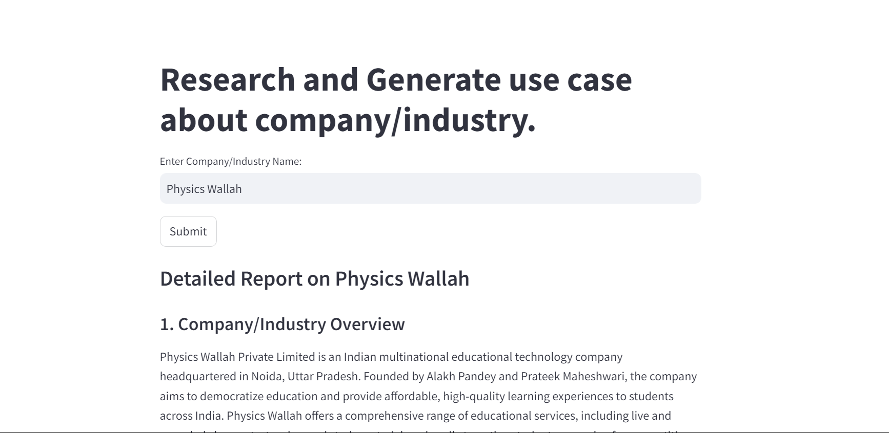
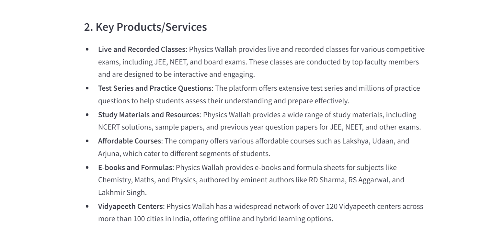
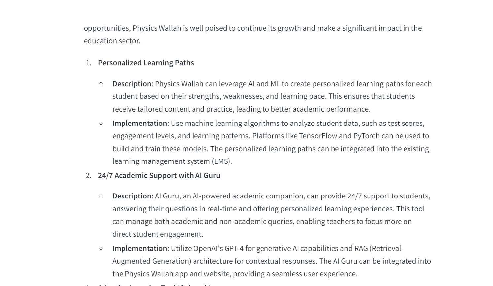

## Description  
A market research tool built with CrewAI that analyzes companies and industries, generates relevant use cases , and identifies implementation resources. 
Simplifies the process of gathering strategic business insights.   
Architecture flow chart  :
  

  
Output ScreenShots :  
1. Market Researcher's response :
  



2.Use Case Agent's response: 
  

3.Final Report: 
  
  
  


## Frameworks/Tools used   
-Crew AI -for building multiple agents.
-CrewAI tools SerperDev for searching internet,ScrapeWebsite for scraping webpage dataPDFSearchTool for searching through pdf reports.    
  
## Learning Resources  
CrewAI docs : https://docs.crewai.com/introduction
Deeplearnig.ai short course : https://www.deeplearning.ai/short-courses/multi-ai-agent-systems-with-crewai/


## Installation  and Seup
1.clone repo  
```
git clone https://github.com/adithya04dev/ai-market-research-agent.git  
```
2.create environment and activate  
```
python -m venv venv    
cd venv    
.\venv\scripts\activate   
```
3.install requirements  
```
pip install - r requirements.txt   
```
4. set serper,together api key in .env file
5. Run streamlit app 
```  
streamlit run app.py  
```

